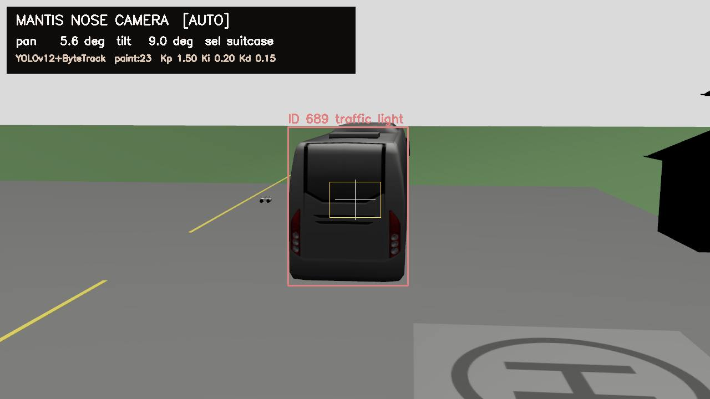
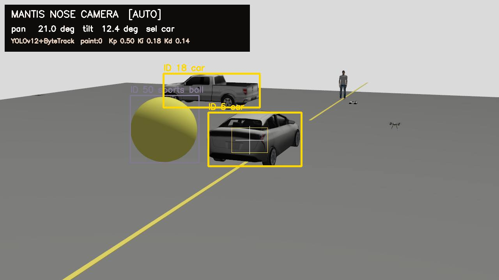
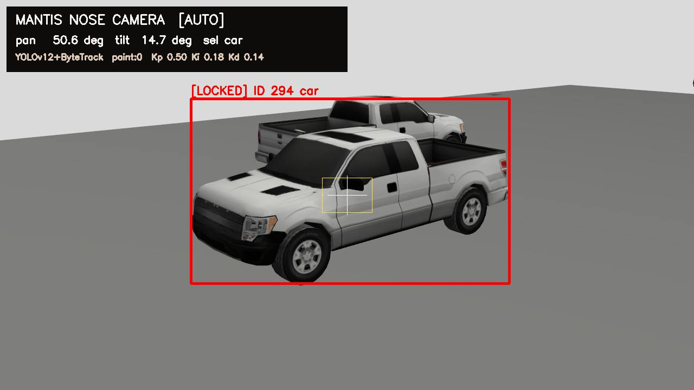
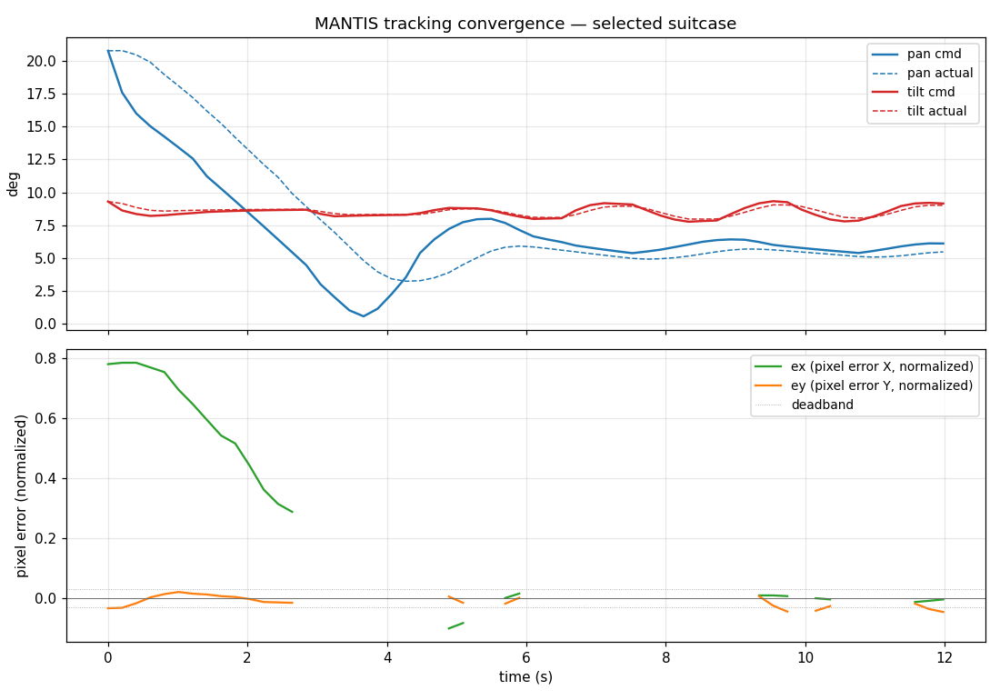
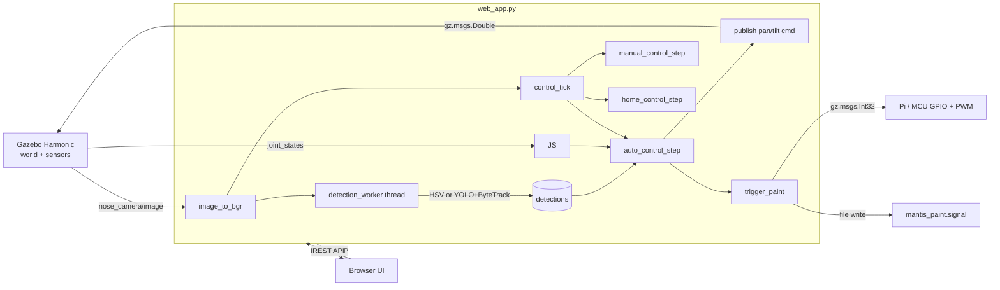
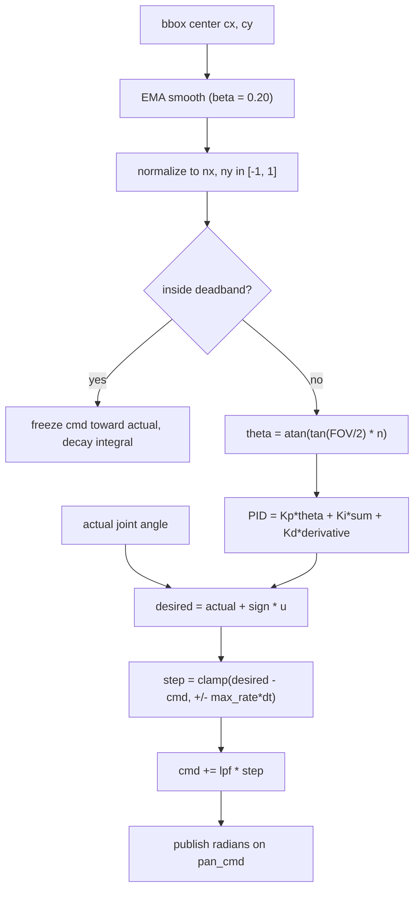

# MANTIS PAINTER

Realtime persistent tracking with precision pan/tilt control.
Gazebo Harmonic simulation on top of a Blender-derived MANTIS chassis,
plus a webcam path for laptop-only testing on macOS / Linux.
Paint events are virtual signals (gz topic + file + UDP/TCP/serial)
so an external Pi / ESP32 / Arduino can react over PWM / GPIO if wired.



### What's in this build

- **Open-vocabulary detector** — switch between **YOLOv12n** (closed COCO-80, ~25 ms),
  **YOLO-World v8s** (any text prompt, ~100 ms), or **HSV color** (~30 FPS on a Pi Zero).
- **Sticky multi-stage resolver** — Pass-1 signature + Kalman + IoU gate;
  Pass-2 same-name + adaptive spatial gate; Pass-3 cross-class anchor; ghost forward-fill;
  long-lost re-acquire by HSV signature within 120 s.
- **Auto Serial Tracker (Sweep painter)** — pick → center → hold 2 s → paint → mark
  done → advance. Scans the camera between pan limits when no fresh target is in FOV
  rather than re-locking the same just-painted object.
- **Auto Zoom** — bbox area-fraction band keeps the locked target a usable size.
- **Connect panel** (top-left, QGC / Mission Planner style) — pick frame source:
  Gazebo sim **or** laptop webcam #0/1/2, plus **Auto Detect** that probes Gazebo first
  then falls back to webcam. Paint signal channels (gz / file / UDP / TCP / serial)
  configure host/port/baud in the same panel.
- **30 m world ring** — 12 props (houses, bus, cabinet, pine tree, mailbox, fire hydrant,
  traffic cones, standing person) at a 30 m radius around the MANTIS for full-FOV sweep testing.

### Dynamic tracking — pursuing moving cars



Crosshair locked on the selected `car`. ByteTrack keeps the ID stable while
the prius and pickup drive opposite circles; the controller follows.
Other detections are drawn but inactive.

### Persistent red [LOCKED] bbox



The resolver maintains identity across YOLO id flips. The red `[LOCKED]` outline
is drawn on the same physical target throughout the lock — even if ByteTrack
re-issues the underlying `det_id` after a brief drop.

### Convergence trace — selecting a target, controller centers it



Top: blue = pan (cmd solid, actual dashed). Red = tilt (same).
Bottom: normalized pixel error of the selected target's bbox center
(`ex` horizontal, `ey` vertical). Dotted lines mark the deadband.

## What kind of tracking is this?

Object-level tracking with a per-target identity stack — not blind pixel tracking.

| layer | what it does | implementation |
|---|---|---|
| Detection | finds objects in the frame | **OpenCV HSV color masks** OR **YOLOv12n** (`ultralytics`) |
| Track association | maintains stable identity across frames | **ByteTrack** for YOLO; name+anchor for color |
| **Per-target Kalman** | predicts where the selected target will be next frame | 4D state `[cx, cy, vx_px_s, vy_px_s]` constant-velocity model, Bhattacharyya gate |
| **HSV histogram signature** | discriminates the locked target from same-class siblings | 16×16 hue/saturation histogram snapshot at select-time, EMA-refreshed on each real match |
| **Motion-model pursuit** | drives the camera through detection gaps | `target_world_pan/tilt_deg` + EMA-estimated bearing rate, exponentially decayed (`τ = 1.8 s`, `max = 4 s`) |
| Pose control | converts bbox-center pixel error to a joint-angle command | FOV-aware `θ = atan(tan(FOV/2) · n)`, cascaded outer PID on **actual** joint state, inner Gazebo `JointPositionController` |

**Result:** if YOLO drops the ByteTrack ID, the resolver picks the candidate whose HSV signature is closest to the locked target AND whose position falls inside the Kalman gate. Same-name fallback uses a composite score `anchor_dist + 800·sig_dist + 200·(1 − size_ratio)`. Long-lost re-acquire window is **120 s** so a target that drives out of view for two minutes is still remembered.

## Features

### Perception
- Pluggable **frame source**: `gz` subscriber on `/mantis/nose_camera/image`
  (1280×720, 30 Hz, HFOV 1.012 rad) **or** `cv2.VideoCapture` on a laptop webcam.
  Switch live via the Connect dropdown — same downstream pipeline.
- HSV color detector with 10+ named color classes (fastest on edge devices).
- **YOLOv12n** detector via `ultralytics` (auto-downloaded on first launch, ~25 ms / frame).
- **YOLO-World v8s** open-vocabulary detector — types any class as text
  (`car`, `red truck`, `drone`, `traffic cone`, ...). Uses CLIP-ViT-B/32
  text embeddings. ~100 ms / frame.
- **ByteTrack** multi-object tracker with persistent IDs across detectors.
- Async detection thread — heavy inference never blocks the Flask UI.
- Detection score filter (`MIN_TRACK_SCORE = 0.05`) to keep weak hits for ByteTrack to filter.

### Tracking
- Real-`dt` PID (not fixed `CONTROL_HZ`)
- FOV-aware pixel-to-angle conversion using `atan(tan(FOV/2) · n)`
- Feedback on **actual** joint position (from `/mantis/joint_states`), not the commanded angle — kills steady-state offset from gravity
- Target-velocity feed-forward with EMA smoothing on bbox centre
- Anti-windup integral clamp, deadband freeze, output low-pass filter
- Lost-target grace (0.8 s) then auto-clear and home
- Identity-stable selection: ByteTrack ID for YOLO, name + nearest-anchor for color

### Control modes
| button | behaviour |
|---|---|
| `Tracking: ON/OFF` | ON = camera actively follows the locked target. OFF = freeze pan/tilt but **keep** the lock (never auto-clears or switches) |
| `Auto Paint: ON/OFF` | one paint pulse whenever the selected target is centered + held. Stays on the same target |
| `Auto Serial Tracker: ON/OFF` | autonomous loop: pick un-painted target → center 2 s → PAINT → mark its `det_id` done → advance. **Forces Tracking ON**. Scans the camera ±FOV when no fresh target is in view |
| `Auto Zoom: ON/OFF` | when the locked target bbox area is too small/large for tracking, zoom in/out automatically (band: 1.2 %–18 % of frame) |
| `Reset memory` | clear painted-id set |
| `Manual / Jog pad / Arrow keys` | drive pan & tilt directly (step 0.5°–10°) |
| `Home` | smooth return to `pan=0, tilt=12°` |
| `STOP` | freeze cmd at current actual angles |
| `Click-to-Aim` | click on the feed aims the camera at that pixel instead of selecting a bbox |
| `PAINT` | one paint pulse on current target. Key `P` / `Space` |
| `Auto-tune` | step-response FOPDT identification + Cohen-Coon → applies gains |
| `zoom` slider / `Shift+↑/↓` | digital zoom 1×–4× on the live feed (anchor + KF remapped server-side) |
| `Connect` (top-left) | **Auto Detect** (probes gz then webcam) / Gazebo / Laptop Webcam #0/1/2, plus paint signal channels + host/port/baud |

### Web UI
- Live MJPEG feed at `http://127.0.0.1:5055`
- Overlay: bounding boxes with track IDs + names, crosshair, HUD with pan/tilt/gains/paint count, paint splash animation on trigger
- Live PID sliders that POST to `/api/gains` while you drag (Speed / Hold / Smooth / Max slew / Lock zone)
- Detector toggle YOLO ↔ Color
- Detections table with click-to-select buttons
- Virtual marks history panel
- Status badge with current mode and sweep indicator

### Hardware-out
- Paint events publish `gz.msgs.Int32(pulse_ms)` on `/mantis/paint_trigger`
- Same event appended to `/tmp/mantis_paint.signal` (one line per pulse)
- A Pi or MCU can subscribe to the topic or tail the file and drive a real GPIO/PWM pin. The sim itself does **not** instantiate any projectile or physical actuator.

## Architecture



## Control loop



## Run

### Linux + Gazebo sim

```bash
./run.sh
# launches Gazebo + Flask UI together. Opens http://127.0.0.1:5055
```

Click **Connect** (top-left) → **Auto Detect** to lock onto the sim camera + joint state.

### macOS / Linux laptop — webcam-only, no sim

```bash
python3 -m venv .venv && source .venv/bin/activate
pip install -r requirements.txt
python3 web_app.py
```

Open http://127.0.0.1:5055 → **Connect** → **Laptop Webcam #0**.
Tracker, sweep painter, paint signal, web UI all run on the laptop camera
exactly the same as on the sim feed.

See [INSTALL.md](INSTALL.md) for full dependency setup including the
optional YOLO-World CLIP weights and webcam permissions.

## Important files

- `web_app.py` — Flask UI, gz transport subscriber, color+YOLO+ByteTrack detector, cascaded PID with actual-joint feedback, paint trigger
- `worlds/mantis_robot_world.sdf` — road, colored boxes, helipad, ArUco tag, x500 quad, rc_cessna, r1_rover, pickup, prius, standing person, MANTIS robot
- `models/mantis_robot/model.sdf` — pan/tilt joints with analytic-PID JointPositionController, JointStatePublisher, world-fixed base
- `scripts/pid_autotune.py` — standalone CLI Cohen-Coon autotune (the in-app `Auto-tune` button uses the same algorithm in-process)
- `scripts/export_mantis_robot.py` — exports Blender objects into Gazebo meshes + SDF
- `scripts/inspect_blend.py` — inspects Blender hierarchy and rotation constraints
- `docs/MECHANISM_AND_3D_ASSETS.md` — exact 3D file paths, joint limits, topics
- `docs/RESEARCH_UPGRADE_PLAN.md` — suggested non-harmful research upgrades

## Topics

| topic | type | direction |
|---|---|---|
| `/mantis/nose_camera/image` | `gz.msgs.Image` | sim → web_app |
| `/mantis/joint_states` | `gz.msgs.Model` | sim → web_app |
| `/mantis/pan_cmd` | `gz.msgs.Double` (rad) | web_app → sim |
| `/mantis/tilt_cmd` | `gz.msgs.Double` (rad) | web_app → sim |
| `/mantis/paint_trigger` | `gz.msgs.Int32` (pulse ms) | web_app → external |

Joint limits (from Blender source):
- Pan: −85.3° to +89.2°
- Tilt: −40.0° to +30.0°

## Keyboard

Global shortcuts (always active, no toggle needed):

| key | action |
|---|---|
| `L` | lock the detection nearest the center crosshair |
| `C` | Clear locked target |
| `A` | switch to Auto (tracking) mode |
| `S` | STOP (freeze pan/tilt) |
| `H` | Home pose |
| `K` | toggle Keyboard jog mode on/off |
| `Esc` / `X` | STOP |
| `P` / `Space` | one paint pulse |
| `Shift+↑` / `Shift+↓` (or Ctrl+↑/↓) | zoom in / out |

Jog (when Keyboard mode is ON):

| key | action |
|---|---|
| `←` / `→` | pan jog by selected step |
| `↑` / `↓` / `W` / `D` | tilt jog by selected step |
| `T` | toggle Tracking ON/OFF |

## Verified tuning (current default gains)

The defaults committed to `web_app.py` were swept and chosen by
`scripts/auto_tune_trial.py` over multiple gain sets and scenes.

| parameter | value | what it does |
|---|---|---|
| Kp (`Speed` slider) | 0.50 | aggressiveness — how hard to chase pixel error |
| Ki (`Hold` slider) | 0.18 | removes steady-state offset |
| Kd (`Smooth` slider) | 0.14 | damping; clamped derivative ±60°/s |
| max_rate (`Max slew`) | 35 deg/s pan, 26 deg/s tilt; scaled by 1/zoom^1.4 at high zoom |
| deadband (`Lock zone`) | 0.008 (pan), 0.012 (tilt) — controller freezes inside this |
| PID output clamp | 6° per cycle — single-frame outlier can't whiplash the joint |
| LPF on cmd | 0.32, softened by 1/√zoom at high zoom |

Measured performance (`scripts/multi_scene_test.py`, latest build):

| scene | real-det frames | unique `selected_id`s | lock_t | SS ex | SS ey |
|---|---|---|---|---|---|
| S1 static | 32/32 | **1** | 3.75 s | +0.001 ± 0.038 | −0.008 ± 0.001 |
| S2 dyn-car | 34/40 | **1** (one transient flip) | 2.5 s | +0.030 ± 0.017 | −0.009 ± 0.004 |
| S3 multi (cars + people + balls) | 30/40 | **1** | 1.5 s | +0.005 ± 0.002 | −0.011 ± 0.003 |
| S4 zoom-stress (1×→2.5×→1×) | 19/20 | 2 | 0.25 s | +0.001 ± 0.000 | −0.007 ± 0.001 |

Lock identity stays on the SAME physical object across YOLO id flips, zoom
transitions and sibling traffic. Pre-fix baseline had S2 unique=3 and S3
never converging.

YOLO-World vs YOLOv12n on the same harness:

| detector | latency | S2 unique ids | S3 unique ids |
|---|---|---|---|
| YOLOv12n + ByteTrack | 25 ms | 1 | 1 |
| YOLO-World v8s + ByteTrack | 100 ms | 3 | 4 |
| YOLOE-11s-seg (CPU) | 380 ms | — (too slow for live track) | — |

Verdict: keep YOLOv12 for known classes; switch to YOLO-World only when
the target class is outside COCO-80.

To re-tune for a different rig: run

```bash
python3 scripts/auto_tune_trial.py
```

It sweeps 5 candidate gain sets across 3 scenes, scores each on
time-to-lock + steady-state error + divergence, and applies the winner.

## Real-world wiring — drive a stepper, servo, or PWM solenoid

The simulation is wired so the same controller can run on a real
turret. A Raspberry Pi or MCU subscribes to one of the output channels
in `/api/channels` and converts each paint pulse + joint angle into
actuator commands.

### Output channels

| channel | enabled by | format | wire it to |
|---|---|---|---|
| `gz_topic` | UI checkbox (default ON) | `gz.msgs.Int32` (pulse_ms) on `/mantis/paint_trigger` | any gz-aware node, ROS2 bridge |
| `file` | UI checkbox (default ON) | line: `time count pulse_ms pan tilt name` appended to `/tmp/mantis_paint.signal` | `tail -F` from a Pi daemon |
| `udp` | UI checkbox | same line as a UDP datagram to `<host>:<port>` | ESP32, MCU on Wi-Fi |
| `tcp` | UI checkbox | one-shot connect + send | server-style actuator daemon |
| `serial` | UI checkbox | pyserial write of the same line | Arduino / Pi GPIO over UART |

The pan and tilt joint targets are also published as `gz.msgs.Double`
on `/mantis/pan_cmd` and `/mantis/tilt_cmd` (radians). Forward those to
your motor driver.

### Example: Raspberry Pi + stepper + servo paintball trigger

```text
+----------------+        +----------------+
| MANTIS PAINTER |--TCP-->| paint_daemon   |    +-------------+
| web_app.py     |--gz-->|  (on the Pi)    |--->| stepper drv | PAN axis (NEMA 17)
|                |        | + RPi.GPIO     |    +-------------+
|                |--gz-->|  + pigpio       |--->| servo PWM   | TILT axis (MG996R)
|                |        |                |    +-------------+
|                |        |                |--->| solenoid    | PAINT (5V relay)
+----------------+        +----------------+    +-------------+
```

Minimal Pi daemon (Python, `pip install pyserial gz-transport13 RPi.GPIO`):

```python
import math, time
import gz.transport13 as gzt
from gz.msgs10.double_pb2 import Double
from gz.msgs10.int32_pb2 import Int32

# Stepper: 200 steps/rev, 1/8 microstepping = 1600 steps / 360 deg
PAN_STEPS_PER_DEG  = 1600 / 360
PAN_DIR_PIN, PAN_STEP_PIN = 23, 24

import RPi.GPIO as GPIO  # not exercised by the sim; wire on the real rig
GPIO.setmode(GPIO.BCM)
GPIO.setup([PAN_DIR_PIN, PAN_STEP_PIN], GPIO.OUT)

import pigpio
pi = pigpio.pi()
TILT_PIN  = 18
PAINT_PIN = 17
pi.set_servo_pulsewidth(TILT_PIN, 1500)

n = gzt.Node()
pan_pos_deg = 0.0

def on_pan(msg: Double):
    global pan_pos_deg
    target = math.degrees(msg.data)
    delta_steps = int((target - pan_pos_deg) * PAN_STEPS_PER_DEG)
    GPIO.output(PAN_DIR_PIN, GPIO.HIGH if delta_steps > 0 else GPIO.LOW)
    for _ in range(abs(delta_steps)):
        GPIO.output(PAN_STEP_PIN, GPIO.HIGH); time.sleep(2e-4)
        GPIO.output(PAN_STEP_PIN, GPIO.LOW);  time.sleep(2e-4)
    pan_pos_deg = target

def on_tilt(msg: Double):
    deg = math.degrees(msg.data)
    # servo pulse: 1.0 ms (−45°) … 2.0 ms (+45°)
    us = 1500 + int(deg / 45.0 * 500)
    pi.set_servo_pulsewidth(TILT_PIN, max(900, min(2100, us)))

def on_paint(msg: Int32):
    pi.gpio_write(PAINT_PIN, 1)
    time.sleep(msg.data / 1000.0)
    pi.gpio_write(PAINT_PIN, 0)

n.subscribe(Double, "/mantis/pan_cmd",       on_pan)
n.subscribe(Double, "/mantis/tilt_cmd",      on_tilt)
n.subscribe(Int32,  "/mantis/paint_trigger", on_paint)
while True: time.sleep(1)
```

Wire the same way for ROS 2 with `ros_gz_bridge` if the rig speaks ROS.

### Real-world rig — laptop + ESP32 + 2 servos

For testing the tracker on hardware without a Pi or Jetson:

```text
USB webcam ──USB──► Laptop ──USB serial──► ESP32 ──PWM──► 2× servos (pan + tilt)
                       │                       └──► 5 V/3 A buck (servo power, separate rail)
                       └─ runs web_app.py
                          (YOLO full speed on laptop CPU/GPU)
```

ESP32 sketch:

```cpp
#include <ESP32Servo.h>
Servo pan, tilt;
void setup(){
  Serial.begin(115200);
  pan.attach(18); tilt.attach(19);
}
void loop(){
  if(Serial.available()){
    String l = Serial.readStringUntil('\n');
    int p = l.indexOf('P'), t = l.indexOf('T');
    if(p>=0 && t>p){
      float pa = l.substring(p+1,t).toFloat();
      float ta = l.substring(t+1).toFloat();
      pan.write(constrain(90 + (int)pa, 0, 180));
      tilt.write(constrain(90 + (int)ta, 0, 180));
    }
  }
}
```

Laptop side replaces the gz pan/tilt publisher with serial writes:

```python
import serial
ser = serial.Serial("/dev/ttyUSB0", 115200)
ser.write(f"P{pan_deg:+.2f}T{tilt_deg:+.2f}\n".encode())
```

Use the **Connect → Laptop Webcam #0** option for the frame source, set the
**serial** paint channel in the Connect panel for the trigger.

### Headless / autonomous mode

Drop the Web UI entirely:

```bash
python3 web_app.py --headless --auto
```

- `--headless`: no Flask, just camera → detect → track → publish loop.
- `--auto`: boots with **Auto Serial Tracker** + **Auto Paint** enabled.

### Health endpoint for a hardware watchdog

```bash
curl http://127.0.0.1:5055/api/health
```

Returns `200` + `{"ok": true, "camera_age_s", "joint_age_s", ...}`
when the loop is alive, or `503` with a list of `issues` if camera or
joint feedback has stalled. Wire your actuator's enable line to a
watchdog that polls this once a second.

## Safe scope

Keep this project focused on:
- robotic perception
- camera simulation
- multi-object tracking
- pan/tilt servo control
- evaluation metrics
- non-physical virtual marking

Do not add:
- real firing, impact or projectile models
- instructions for building or deploying a physical launcher
- autonomous engagement logic outside this closed educational simulation
