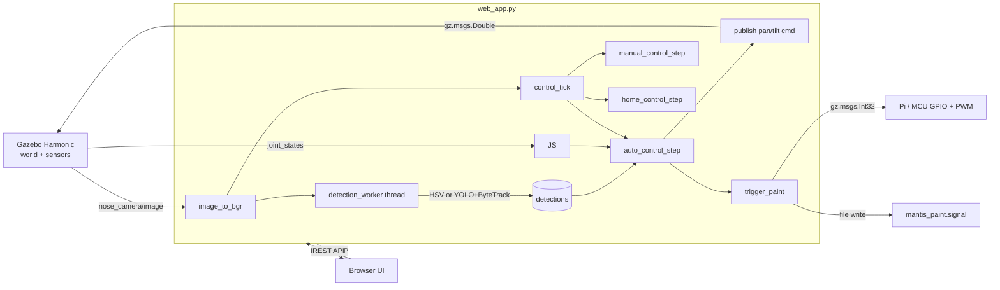
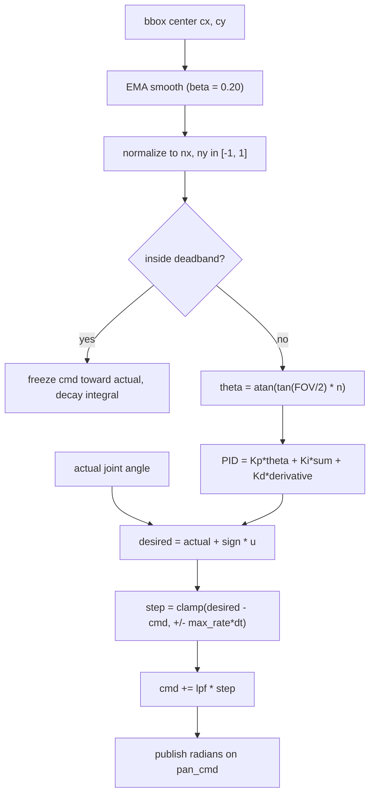

# MANTIS PAINTER

Realtime persistent tracking with precision pan/tilt control. Gazebo Harmonic simulation built on top of a Blender-derived MANTIS chassis. Educational scope only — no projectile physics, no real-world deployment instructions. Paint events are virtual signals (gz topic + file) so an external Raspberry Pi or MCU can react over PWM / GPIO if wired.


### Convergence trace — selecting a car, controller centers it


Top: blue = pan (cmd solid, actual dashed). Red = tilt (same). Bottom: normalized pixel error of the selected target's bbox center (`ex` horizontal, `ey` vertical). The dotted lines mark the deadband.

## What kind of tracking is this?

Object-level tracking, not blind pixel tracking.

| layer | what it does | implementation |
|---|---|---|
| Detection | finds what objects are in the frame | **OpenCV HSV color masks** (red, blue, green, yellow, cyan, magenta, orange, brown, teal, purple) **or YOLOv12n** (`ultralytics`) on the same frame |
| Track association | keeps a stable identity for the same object across frames | **ByteTrack** (Kalman filter + IoU association) for YOLO mode; **name + nearest-bbox-anchor** with a 240 px gate for color mode |
| Pose control | converts bbox-center pixel error to a joint-angle command | FOV-aware mapping `θ = atan(tan(FOV/2) · n)`, cascaded outer PID on the **actual** joint state, inner Gazebo `JointPositionController` |

So the controller does not chase a pixel — it chases a *tracked object*. If the bbox jitters by 5 px the smoothed center barely moves; if YOLO swaps the IDs of two cars, ByteTrack keeps the one you clicked.

## Features

### Perception
- Live `gz.msgs.Image` subscription on `/mantis/nose_camera/image` (1280×720, 30 Hz, HFOV 1.012 rad)
- HSV color detector with 10+ named color classes
- **YOLOv12n** detector via `ultralytics` (auto-downloaded on first launch)
- **ByteTrack** multi-object tracker with persistent IDs
- Async detection thread — heavy inference never blocks the Flask UI
- Detection score filter (`MIN_TRACK_SCORE = 0.15`) to ignore weak hits

### Tracking
- Real-`dt` PID (not fixed `CONTROL_HZ`)
- FOV-aware pixel-to-angle conversion using `atan(tan(FOV/2) · n)`
- Feedback on **actual** joint position (from `/mantis/joint_states`), not the commanded angle — kills steady-state offset from gravity
- Target-velocity feed-forward with EMA smoothing on bbox centre
- Anti-windup integral clamp, deadband freeze, output low-pass filter
- Lost-target grace (0.8 s) then auto-clear and home
- Identity-stable selection: ByteTrack ID for YOLO, name + nearest-anchor for color

### Control modes
| button | behaviour |
|---|---|
| `Tracking: ON/OFF` | toggle auto-tracking of the selected target |
| `Auto Paint: ON/OFF` | fire one paint pulse whenever the selected target is centred and held. Stays on the same target |
| `Auto Serial Tracker: ON/OFF` | fully autonomous loop: pick next un-painted target → centre → paint → advance. Remembers painted targets across sessions (`/tmp/mantis_painted_memory.json`). Independent of Tracking switch |
| `Reset memory` | clear the painted-target memory |
| `Manual / Jog pad / Arrow keys` | drive pan & tilt directly with step size 0.5°–10° |
| `Home` | smooth return to `pan=0, tilt=12°` |
| `STOP` | freeze cmd at current actual angles |
| `Click-to-Aim` | clicks on the feed aim the camera at that pixel instead of selecting a bbox |
| `PAINT` | one paint pulse on current target. Key `P` |
| `Auto-tune` | step-response FOPDT identification + Cohen-Coon → applies gains |
| `zoom` slider | browser-side digital zoom 1×–4× on the live feed (clicks are corrected back to source coords) |

### Web UI
- Live MJPEG feed at `http://127.0.0.1:5055`
- Overlay: bounding boxes with track IDs + names, crosshair, HUD with pan/tilt/gains/paint count, paint splash animation on trigger
- Live PID sliders that POST to `/api/gains` while you drag (Speed / Hold / Smooth / Max slew / Lock zone)
- Detector toggle YOLO ↔ Color
- Detections table with click-to-select buttons
- Virtual marks history panel
- Status badge with current mode and sweep indicator

### Hardware-out
- Paint events publish `gz.msgs.Int32(pulse_ms)` on `/mantis/paint_trigger`
- Same event appended to `/tmp/mantis_paint.signal` (one line per pulse)
- A Pi or MCU can subscribe to the topic or tail the file and drive a real GPIO/PWM pin. The sim itself does **not** instantiate any projectile or physical actuator.

## Architecture



## Control loop



## Run

Terminal 1:
```bash
cd /home/sanju/MANTIS_PAINTER
gz sim -v 3 worlds/mantis_robot_world.sdf
```

Terminal 2:
```bash
cd /home/sanju/MANTIS_PAINTER
/home/sanju/venv-ardupilot/bin/python3 web_app.py     # needs flask + gz python + ultralytics
```

Open `http://127.0.0.1:5055`.

## Important files

- `web_app.py` — Flask UI, gz transport subscriber, color+YOLO+ByteTrack detector, cascaded PID with actual-joint feedback, paint trigger
- `worlds/mantis_robot_world.sdf` — road, colored boxes, helipad, ArUco tag, x500 quad, rc_cessna, r1_rover, pickup, prius, standing person, MANTIS robot
- `models/mantis_robot/model.sdf` — pan/tilt joints with analytic-PID JointPositionController, JointStatePublisher, world-fixed base
- `scripts/pid_autotune.py` — standalone CLI Cohen-Coon autotune (the in-app `Auto-tune` button uses the same algorithm in-process)
- `scripts/export_mantis_robot.py` — exports Blender objects into Gazebo meshes + SDF
- `scripts/inspect_blend.py` — inspects Blender hierarchy and rotation constraints
- `docs/MECHANISM_AND_3D_ASSETS.md` — exact 3D file paths, joint limits, topics
- `docs/RESEARCH_UPGRADE_PLAN.md` — suggested non-harmful research upgrades

## Topics

| topic | type | direction |
|---|---|---|
| `/mantis/nose_camera/image` | `gz.msgs.Image` | sim → web_app |
| `/mantis/joint_states` | `gz.msgs.Model` | sim → web_app |
| `/mantis/pan_cmd` | `gz.msgs.Double` (rad) | web_app → sim |
| `/mantis/tilt_cmd` | `gz.msgs.Double` (rad) | web_app → sim |
| `/mantis/paint_trigger` | `gz.msgs.Int32` (pulse ms) | web_app → external |

Joint limits (from Blender source):
- Pan: −85.3° to +89.2°
- Tilt: −40.0° to +30.0°

## Keyboard

| key | action |
|---|---|
| arrows / WASD | jog pan / tilt by selected step |
| Space | Home |
| T | toggle Tracking ON/OFF |
| C | Clear target |
| P | one paint pulse |
| Esc / X | STOP |

## Safe scope

Keep this project focused on:
- robotic perception
- camera simulation
- multi-object tracking
- pan/tilt servo control
- evaluation metrics
- non-physical virtual marking

Do not add:
- real firing, impact or projectile models
- instructions for building or deploying a physical launcher
- autonomous engagement logic outside this closed educational simulation
